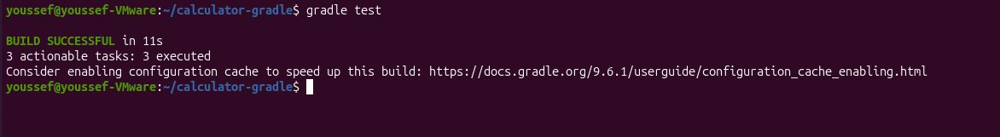
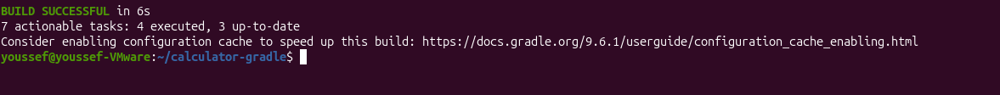
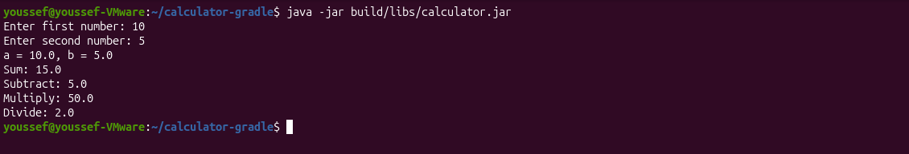

# Lab 1 - Building and Packaging Java Application with Gradle

## Objective

Build, test, package, and run a Java application using Gradle.

---

## Source Code

The application used in this lab is based on:

https://github.com/Ibrahim-Adel15/calculator-gradle

---

## Prerequisites

- Java JDK
- Gradle
- Git

---

## Run Unit Tests

```bash
gradle test
```

**Output**



---

## Build the Application

```bash
gradle build
```

**Output**



---

## Generated Artifact

```text
build/libs/calculator.jar
```

---

## Run the Application

```bash
java -jar build/libs/calculator.jar
```

**Output**



---

## Result

- ✅ Unit tests passed successfully.
- ✅ JAR file generated successfully.
- ✅ Application executed successfully.