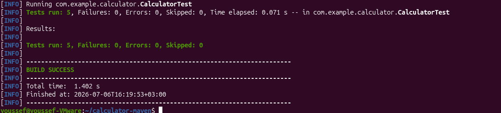
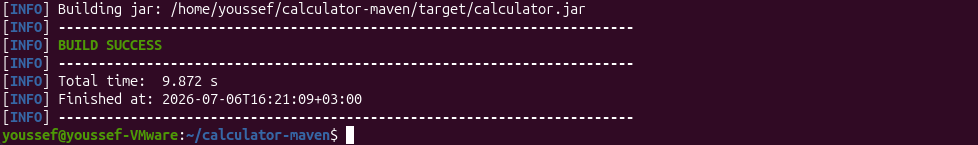
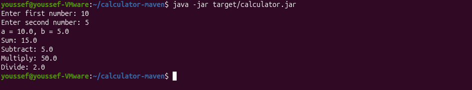

# Lab 2 - Building and Packaging Java Application with Maven

## Objective

Build, test, package, and run a Java application using Maven.

---

## Source Code

The application used in this lab is based on:

https://github.com/Ibrahim-Adel15/calculator-maven

---

## Prerequisites

- Java JDK
- Maven
- Git

---

## Run Unit Tests

```bash
mvn test
```

**Output**



---

## Build the Application

```bash
mvn package
```

**Output**



---

## Generated Artifact

```text
target/calculator.jar
```

---

## Run the Application

```bash
java -jar target/calculator.jar
```

**Output**



---

## Result

- ✅ Unit tests passed successfully.
- ✅ JAR file generated successfully.
- ✅ Application executed successfully.