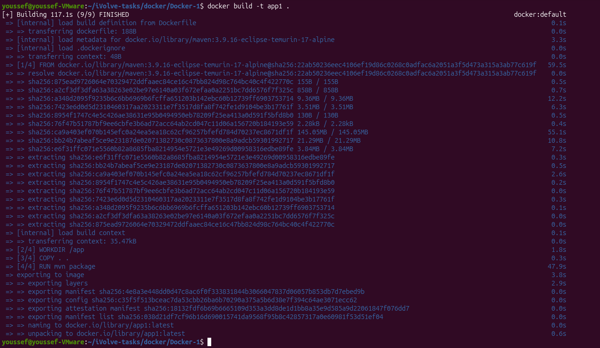
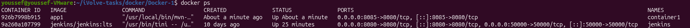

# Lab 3 - Run Java Spring Boot App in a Container

## Objective

Build and run a Java Spring Boot application inside a Docker container using a Maven base image.

---

## Source Code

The application used in this lab is based on:

https://github.com/Ibrahim-Adel15/Docker-1

---

## Prerequisites

- Docker
- Git

---

## Dockerfile

```dockerfile
FROM maven:3.9.16-eclipse-temurin-17-alpine

WORKDIR /app

COPY . .

RUN mvn package

EXPOSE 8080

CMD ["java", "-jar", "target/demo-0.0.1-SNAPSHOT.jar"]
```

---

## Build the Docker Image

```bash
docker build -t app1 .
```

**Output**



---

## Verify Image Size

```bash
docker images app1
```

**Output**


---

## Run the Container

```bash
docker run -d -p 8085:8080 --name container1 app1
```

**Output**



> **Note:** Port `8085` was used on the host because port `8080` was already occupied by Jenkins. The application still listens on port `8080` inside the container.

---

## Test the Application

```bash
curl localhost:8085
```

**Output**


---

## Stop the Container

```bash
docker stop container1
```

---

## Remove the Container

```bash
docker rm container1
```

---

## Result

- ✅ Docker image built successfully.
- ✅ Image size verified.
- ✅ Container started successfully.
- ✅ Application responded successfully.
- ✅ Container stopped and removed successfully.