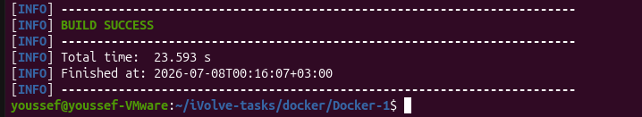
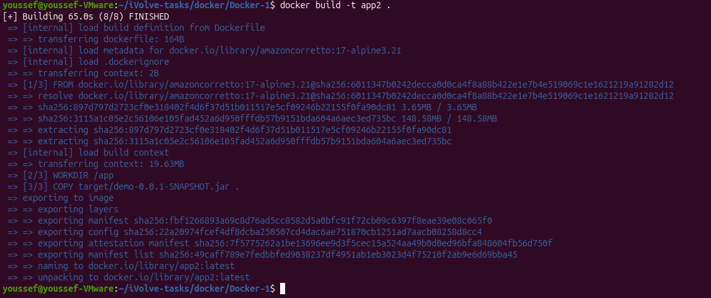
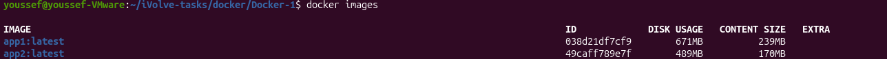
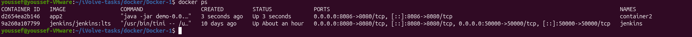

# Lab 4 - Run Java Spring Boot App in a Container

## Objective

Build a Java Spring Boot application on the host machine, then run it inside a Docker container using a Java 17 runtime image.

---

## Source Code

The application used in this lab is based on:

https://github.com/Ibrahim-Adel15/Docker-1

---

## Prerequisites

- Java JDK 17
- Maven
- Docker
- Git

---

## Build the Application

```bash
mvn package
```

**Output**



---

## Dockerfile

```dockerfile
FROM amazoncorretto:17-alpine3.21

WORKDIR /app

COPY target/demo-0.0.1-SNAPSHOT.jar .

EXPOSE 8080

CMD ["java","-jar","demo-0.0.1-SNAPSHOT.jar"]
```

---

## Build the Docker Image

```bash
docker build -t app2 .
```

**Output**



---

## Verify Image Size

```bash
docker images app2
```

**Output**



---

## Run the Container

```bash
docker run -d -p 8086:8080 --name container2 app2
```

**Output**



> **Note:** Port `8086` was used on the host because port `8080` was already occupied by Jenkins.

---

## Test the Application

```bash
curl localhost:8086
```

**Output**


---

## Stop the Container

```bash
docker stop container2
```

---

## Remove the Container

```bash
docker rm container2
```

---

## Result

- ✅ Application built successfully using Maven.
- ✅ Docker image created successfully.
- ✅ Image size verified.
- ✅ Container started successfully.
- ✅ Application responded successfully.
- ✅ Container stopped and removed successfully.