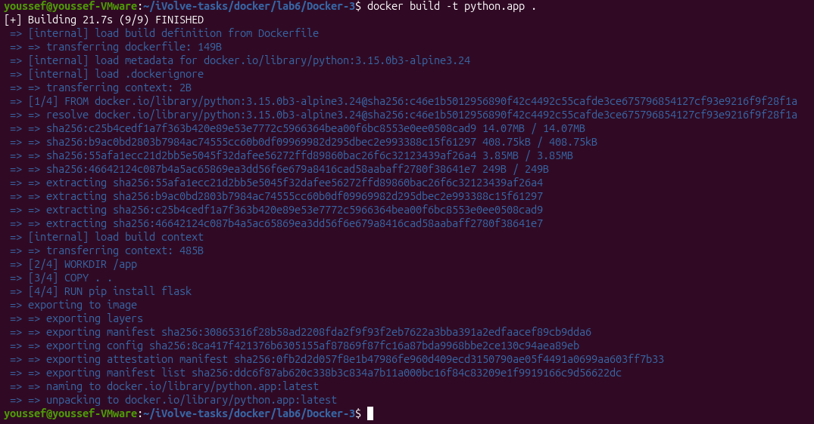
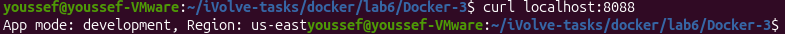
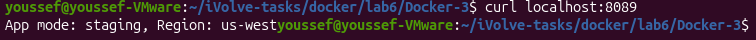
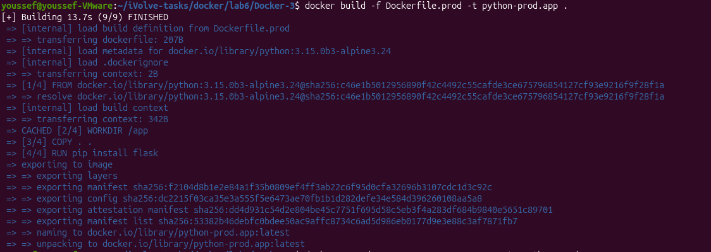
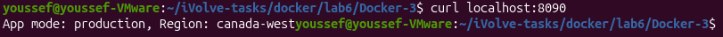

# Lab 6 - Managing Docker Environment Variables Across Build and Runtime

## Objective

Run a Flask application inside Docker and manage environment variables using different methods during build and runtime.

---

## Source Code

The application used in this lab is based on:

https://github.com/Ibrahim-Adel15/Docker-3

---

## Prerequisites

- Docker
- Git

---

## Dockerfile

```dockerfile
FROM python:3.15.0b3-alpine3.24
WORKDIR /app
COPY . .
RUN pip install flask
EXPOSE 8080
CMD ["python","app.py"]
```

---

## Dockerfile (Production)

```dockerfile
FROM python:3.15.0b3-alpine3.24
WORKDIR /app
COPY . .
RUN pip install flask
ENV APP_MODE=production
ENV APP_REGION=canada-west
EXPOSE 8080
CMD ["python","app.py"]
```

---

## Build the Docker Image

```bash
docker build -t python.app .
```

**Output**



---

## Run Container with Environment Variables from Command Line

```bash
docker run -d \
-p 8088:8080 \
-e APP_MODE=development \
-e APP_REGION=us-east \
--name py-cont1 python.app
```

### Verify

```bash
curl localhost:8088
```

**Output**



---

## Run Container with Environment Variables from File

Create a file named `staging.env`

```text
APP_MODE=staging
APP_REGION=us-west
```

Run the container:

```bash
docker run -d \
-p 8089:8080 \
--env-file staging.env \
--name py-cont2 python.app
```

### Verify

```bash
curl localhost:8089
```

**Output**



---

## Build Production Image

```bash
docker build -f Dockerfile.prod -t python-prod.app .
```

**Output**



---

## Run Container with Environment Variables Defined in Dockerfile

```bash
docker run -d \
-p 8090:8080 \
--name py-cont3 python-prod.app
```

### Verify

```bash
curl localhost:8090
```

**Output**



---

## Stop and Remove Containers

```bash
docker stop py-cont1 py-cont2 py-cont3

docker rm py-cont1 py-cont2 py-cont3
```

---

## Remove Images

```bash
docker rmi python.app python-prod.app
```

---

## Result

- ✅ Flask application containerized successfully.
- ✅ Environment variables passed through the command line.
- ✅ Environment variables loaded from an external file.
- ✅ Environment variables defined inside the Docker image.
- ✅ All three configurations verified successfully.