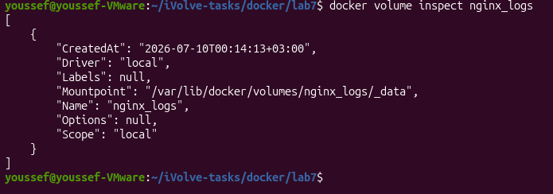
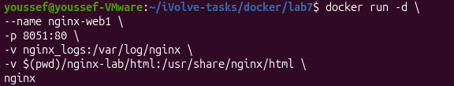
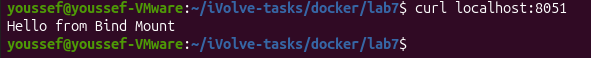
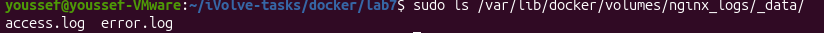

# Lab 7 - Docker Volume and Bind Mount with Nginx

## Objective

Use Docker Volumes and Bind Mounts with an Nginx container to persist logs and serve static content from the host machine.

---

## Prerequisites

- Docker

---

## Create Docker Volume

Create a Docker volume to persist Nginx logs.

```bash
docker volume create nginx_logs
```

### Verify Volume

```bash
docker volume inspect nginx_logs
```

**Output**



---

## Create HTML File

Create the following directory:

```text
nginx-lab/html/
```

Create an `index.html` file with the following content:

```text
Hello from Bind Mount
```

---

## Run Nginx Container

Run an Nginx container with:

- Docker Volume for `/var/log/nginx`
- Bind Mount for `/usr/share/nginx/html`

```bash
docker run -d \
--name nginx-web1 \
-p 8051:80 \
-v nginx_logs:/var/log/nginx \
-v $(pwd)/nginx-lab/html:/usr/share/nginx/html \
nginx
```

**Output**



---

## Verify the Web Page

```bash
curl localhost:8051
```

**Output**



---

## Update the HTML File

Modify `index.html` on the host machine, then verify the changes.

```bash
curl localhost:8051
```

**Output**


---

## Verify Nginx Logs

```bash
sudo ls /var/lib/docker/volumes/nginx_logs/_data/
```

**Output**



---

## Remove the Volume

```bash
docker stop nginx-web1

docker rm nginx-web1

docker volume rm nginx_logs
```
---

## Result

- ✅ Docker volume created successfully.
- ✅ Bind mount served the HTML file from the host machine.
- ✅ Changes to the HTML file were reflected immediately.
- ✅ Nginx logs were stored in the Docker volume.
- ✅ Docker volume removed successfully.