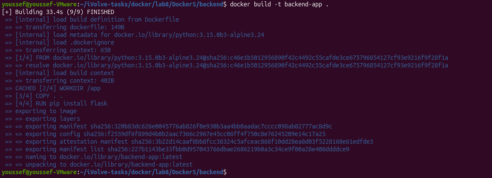
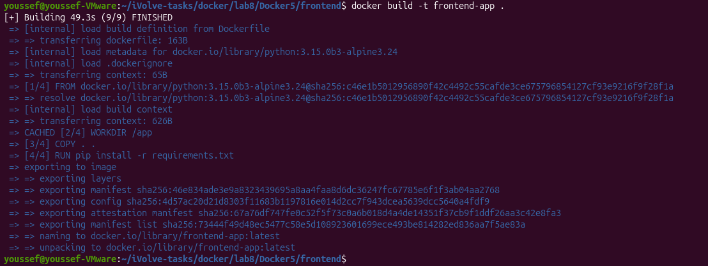
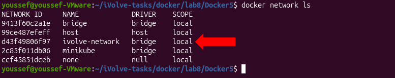
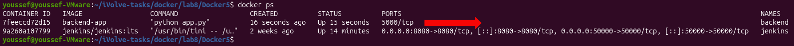
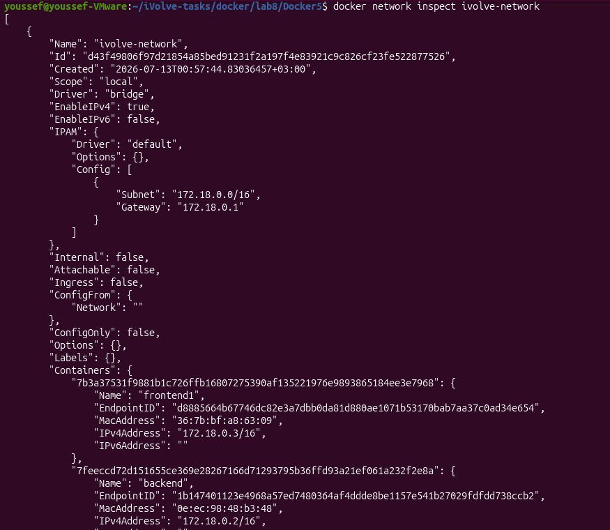
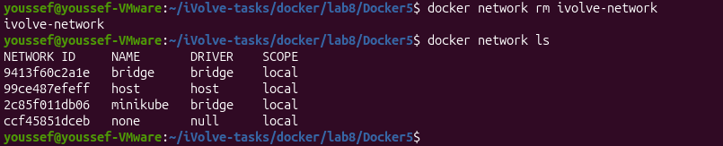

# Lab 8 - Custom Docker Network for Microservices

## Objective

Create a custom Docker network and verify communication between frontend and backend containers.

---

## Source Code

The application used in this lab is based on:

https://github.com/Ibrahim-Adel15/Docker5

---

## Prerequisites

- Docker
- Git

---

## Build Backend Image

The backend image is built using a Python base image and installs Flask.

```bash
cd backend

docker build -t backend-app .
```

**Output**



---

## Build Frontend Image

The frontend image is built using a Python base image and installs the required packages from `requirements.txt`.

```bash
cd frontend

docker build -t frontend-app .
```

**Output**



---

## Create Docker Network

Create a custom Docker network.

```bash
docker network create ivolve-network
```

**Output**



---

## Run Backend Container

Run the backend container using the custom network.

```bash
docker run -d --name backend --network ivolve-network backend-app
```
**Output**



---

## Run Frontend Container (frontend1)

Run the first frontend container using the same custom network.

```bash
docker run -d --name frontend1 --network ivolve-network -p 5001:5000 frontend-app
```

Verify communication.

```bash
curl localhost:5001
```

**Output**


---

## Run Frontend Container (frontend2)

Run another frontend container using the default Docker network.

```bash
docker run -d --name frontend2 -p 5002:5000 frontend-app
```

Verify communication.

```bash
curl localhost:5002
```

**Output**


---

## Verify Docker Network

Inspect the custom network.

```bash
docker network inspect ivolve-network
```

**Output**



---

## Remove Docker Network

Stop and remove the containers, then delete the network.

```bash
docker stop backend frontend1 frontend2

docker rm backend frontend1 frontend2

docker network rm ivolve-network
```

**Output**



---

## Result

- ✅ Backend image built successfully.
- ✅ Frontend image built successfully.
- ✅ Custom Docker network created successfully.
- ✅ Frontend1 communicated with the backend over the custom network.
- ✅ Frontend2 could not communicate with the backend using the default network.
- ✅ Docker network removed successfully.