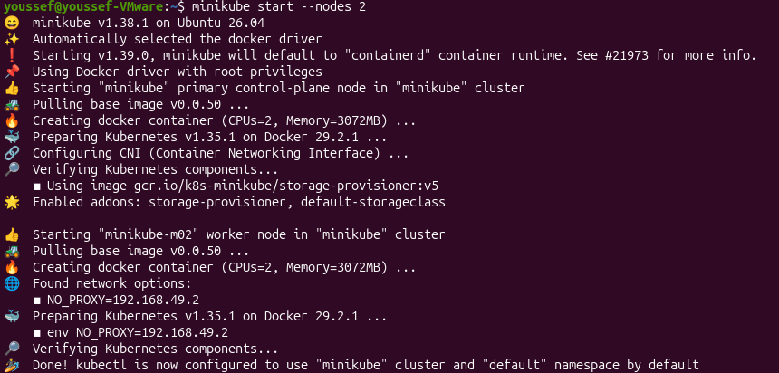
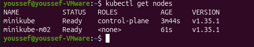
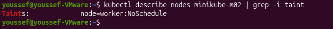

# Lab 10 - Node Isolation Using Taints in Kubernetes

## Objective

Create a Kubernetes cluster with two nodes, apply a taint to the worker node, and verify that the taint is successfully applied.

---

## Prerequisites

Docker
Minikube
kubectl

---

## Start Kubernetes Cluster

Start a Kubernetes cluster with two nodes.
```bash
minikube start --nodes 2
```
**Output**



---

## Verify Cluster Nodes

Verify that the cluster contains two nodes.
```bash
kubectl get nodes
```

**Output**



---

## Apply Taint to Worker Node

Apply a taint to the worker node.

```bash
kubectl taint nodes minikube-m02 node=worker:NoSchedule
```
---

## Verify the Taint

Describe the worker node and verify the taint.

```bash
kubectl describe node minikube-m02
```

**Output**



---

## Result

✅ Kubernetes cluster created successfully with two nodes.
✅ Worker node tainted with node=worker:NoSchedule.
✅ Taint verified successfully using kubectl describe.