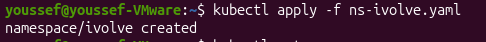
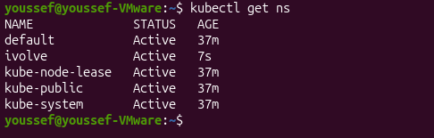
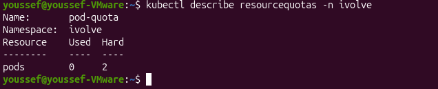
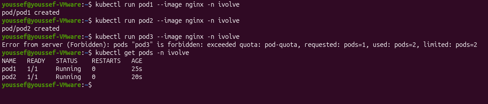

# Lab 11 - Namespace Management and Resource Quota Enforcement

## Objective

Create a namespace and apply a ResourceQuota to limit the number of pods to only two within the namespace.

---

## Prerequisites

Docker

Minikube

kubectl

---

## Create Namespace

Create a new namespace.

```bash
kubectl apply -f ns-ivolve.yaml
```

**Output**



---

## Verify Namespace

Verify that the namespace has been created.

```bash
kubectl get namespaces
```

**Output**



---

## Create ResourceQuota

Apply the ResourceQuota manifest.

```bash
kubectl apply -f resource-quota.yaml -n ivolve
```

**Output**


---

## Verify ResourceQuota

Verify that the ResourceQuota has been applied successfully.

```bash
kubectl describe resourcequota pod-quota -n ivolve
```

**Output**



---

## Test ResourceQuota

Create the first pod.

```bash
kubectl run pod1 --image nginx -n ivolve
```

Create the second pod.

```bash
kubectl run pod2 --image nginx -n ivolve
```

Attempt to create a third pod.

```bash
kubectl run pod3 --image nginx -n ivolve
```

**Output**



---

Result

✅ Namespace created successfully.

✅ ResourceQuota applied successfully.

✅ Only two pods were allowed in the namespace.

✅ Creation of the third pod was denied due to the ResourceQuota limit.
