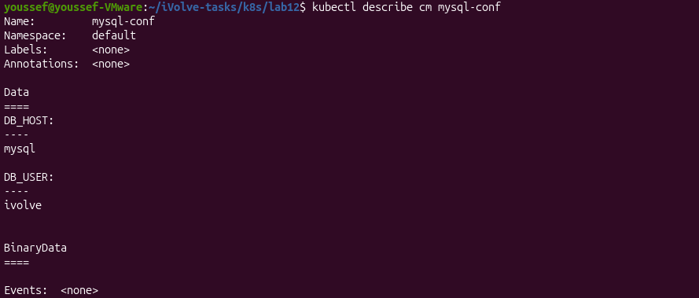
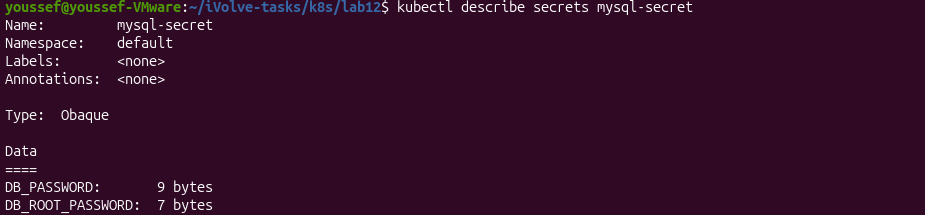

# Lab 12 - Managing Configuration and Sensitive Data with ConfigMaps and Secrets

## Objective

Store non-sensitive configuration using a ConfigMap and sensitive data using a Secret.

---

## Prerequisites

- Docker
- Minikube
- kubectl

---

## Create ConfigMap

Create the ConfigMap.

```bash
kubectl apply -f configmap.yaml
```

**Output**


---

## Verify ConfigMap

Verify that the ConfigMap has been created successfully.

```bash
kubectl describe configmap mysql-conf
```

**Output**



---

## Create Secret

Create the Secret containing the database credentials.

```bash
kubectl apply -f secret.yaml
```

**Output**


---

## Verify Secret

Verify that the Secret has been created successfully.

```bash
kubectl describe secret mysql-secret
```

**Output**



---

## Result

- ✅ ConfigMap created successfully.
- ✅ MySQL configuration stored in the ConfigMap.
- ✅ Secret created successfully using Base64-encoded values.
- ✅ Sensitive database credentials stored securely in the Secret.