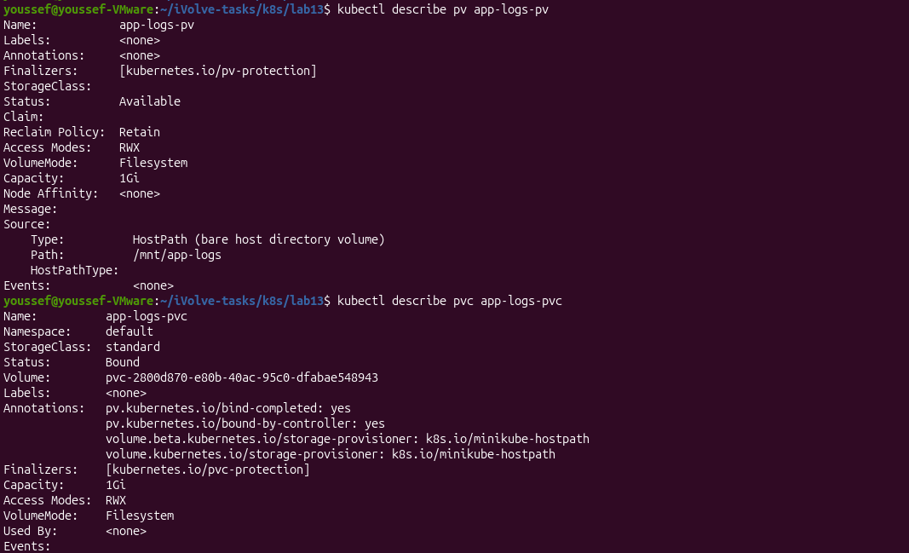

# Lab 13 - Persistent Storage Setup for Application Logging

## Objective

Create a PersistentVolume (PV) and a PersistentVolumeClaim (PVC) to provide persistent storage for application logs.

---

## Prerequisites

- Docker
- Minikube
- kubectl

---

## Create Persistent Volume

Create the PersistentVolume.

```bash
kubectl apply -f persistent-volume.yaml
```

**Output**


---

## Verify Persistent Volume

Verify that the PersistentVolume has been created successfully.

```bash
kubectl get pv
```

**Output**


---

## Create Persistent Volume Claim

Create the PersistentVolumeClaim.

```bash
kubectl apply -f persistent-volume-claim.yaml
```

**Output**


---

## Verify Persistent Volume Claim

Verify that the PersistentVolumeClaim has been created successfully.

```bash
kubectl get pvc
```

**Output**


---

## Verify PV and PVC Binding

Verify that the PersistentVolume and PersistentVolumeClaim are successfully bound.

```bash
kubectl describe pv app-logs-pv

kubectl describe pvc app-logs-pvc
```

**Output**



---

## Result

- ✅ PersistentVolume created successfully.
- ✅ PersistentVolumeClaim created successfully.
- ✅ PV and PVC successfully bound.
- ✅ Persistent storage configured for application logging.