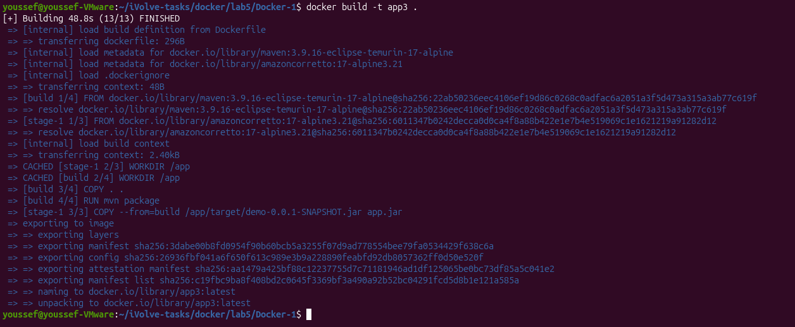
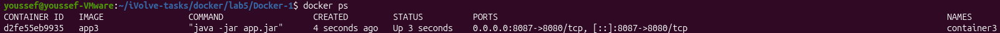

# Lab 5 - Multi-Stage Build for a Java Spring Boot Application

## Objective

Build and run a Java Spring Boot application using a multi-stage Docker build to produce a smaller and more efficient runtime image.

---

## Source Code

The application used in this lab is based on:

https://github.com/Ibrahim-Adel15/Docker-1

---

## Prerequisites

- Docker
- Git

---

## Dockerfile

```dockerfile
FROM maven:3.9.16-eclipse-temurin-17-alpine AS build
WORKDIR /app
COPY . .
RUN mvn clean package

FROM amazoncorretto:17-alpine3.21
WORKDIR /app

COPY --from=build /app/target/demo-0.0.1-SNAPSHOT.jar app.jar
CMD ["java","-jar","app.jar"]
EXPOSE 8080

```

---

## Build the Docker Image

```bash
docker build -t app3 .
```

**Output**



---

## Verify Image Size

```bash
docker images app3
```

**Output**


---

## Run the Container

```bash
docker run -d -p 8087:8080 --name container3 app3
```

**Output**



> **Note:** Port `8087` was used on the host because other ports were already in use.

---

## Test the Application

```bash
curl localhost:8087
```

**Output**


---

## Stop the Container

```bash
docker stop container3
```

---

## Remove the Container

```bash
docker rm container3
```

---

## Delete the Image

```bash
docker rmi app3
```

---

## Result

- ✅ Application built successfully using a multi-stage Docker build.
- ✅ Runtime image contains only the application JAR and Java runtime.
- ✅ Image size verified.
- ✅ Container started successfully.
- ✅ Application responded successfully.
- ✅ Container and image removed successfully.